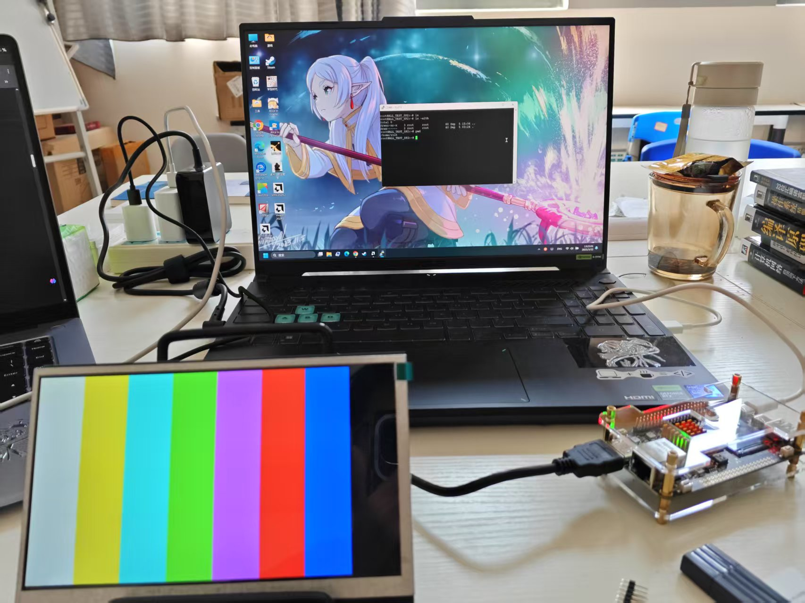
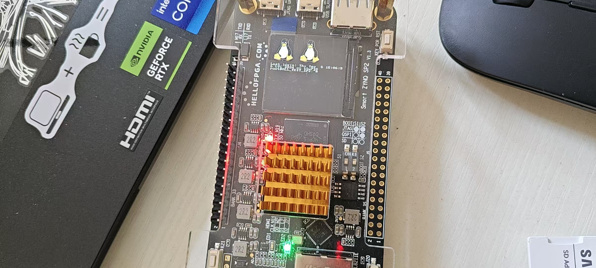
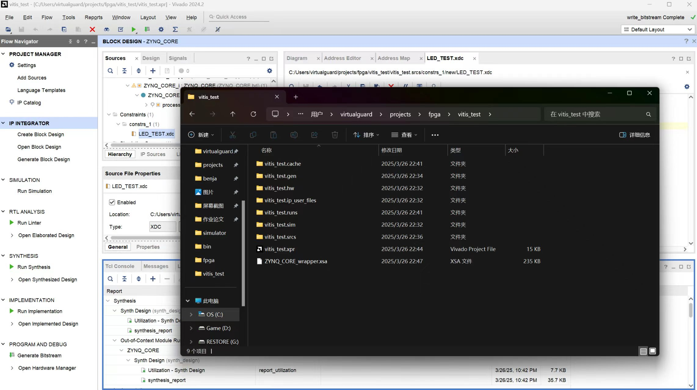
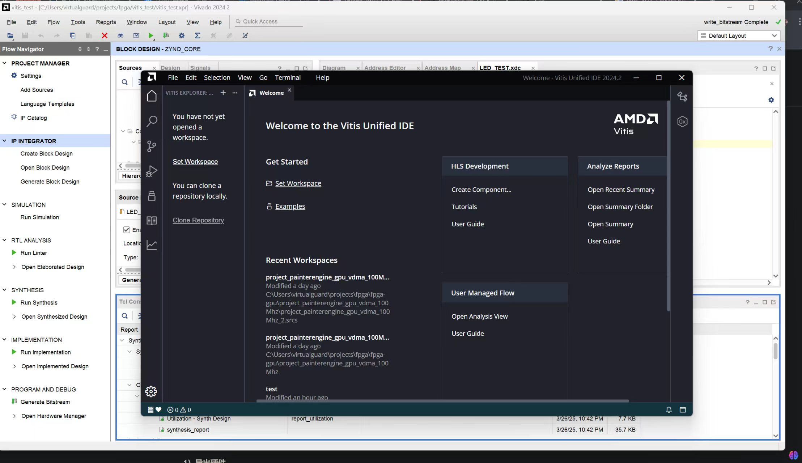
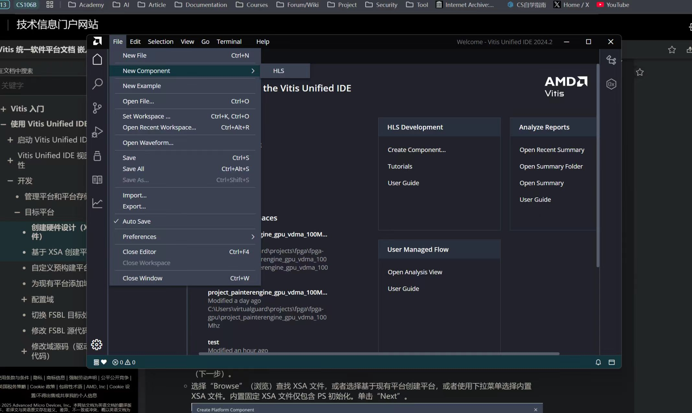
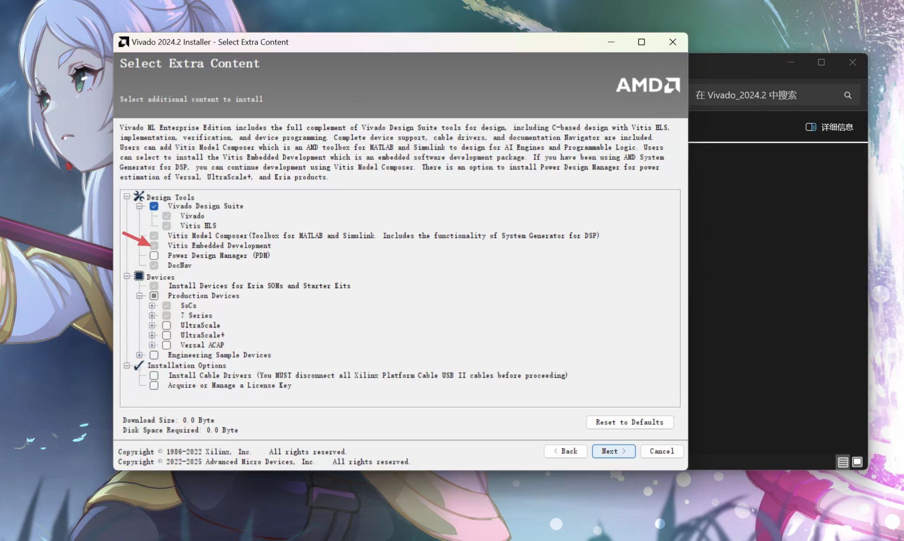

## 导言

在互联网上，我们能够找到数不胜数的有关手搓**CPU**的项目资料，甚至有大佬为此出版专门的教程，但很少能够看到有关GPU的资料。

本次项目旨在通过参考网上上少有的资料，基于**FPGA（现场可编程门阵列）**实现一个寄存器传输级（RTL）的图形加速器，即显卡或**GPU（Graphics Processing Unit）**。当然，商业级的显卡与单纯的GPU芯片并不是同一个概念，我们的目标仅仅只是设计一个能够加速图形渲染速度的**IP核（Intellectual Property Core）**。 <br>

项目主要分为两个阶段：**模板复现**与**功能扩展**。 <br>

在模板复现阶段，我们将根据知乎文章[从零开始制作一个属于你自己的GPU | 基于FPGA的图形加速器实现原理](https://zhuanlan.zhihu.com/p/714400366?utm_psn=1883987006549374851)的指导复现出其中的图形渲染场景。 <br>

**Let's begin our journey!** <br>

---
项目名称：FPGA-GPU

项目成员：virtualguard_C <br>

项目指导：vigosser_L <br>

项目核心参考：[从零开始制作一个属于你自己的GPU | 基于FPGA的图形加速器实现原理](https://zhuanlan.zhihu.com/p/714400366?utm_psn=1883987006549374851)

项目核心参考代码仓库：[PainterEngine](https://github.com/matrixcascade/PainterEngine)

---
## 复现阶段

### 预备阶段

---
- **提出项目，验证可行性**
- **收集相关理论资料**
- **预备开发环境**
---

#### 第0周（2025.3.15-16）

##### 2025.3.15晚:

- **项目指导提出项目，提供核心参考文献（以下简称原文）[从零开始制作一个属于你自己的GPU | 基于FPGA的图形加速器实现原理](https://zhuanlan.zhihu.com/p/714400366?utm_psn=1883987006549374851)，项目启动**

##### 2025.3.16:

- **第一次线下交流，确定方向**

- 通过直接询问核心参考文献作者（以下简称作者）及ai查询相结合的方式，解决C项目在linux系统上（Ubuntu22.04）的编译配置问题（Makefile配置），成功复现**上层C语言层面的软渲染器实现**。具体配置如下：

winodws系统配置和其他具体过程这里不再赘述，详情可参考原文，这里只说明在linux上的编译配置。

创建独立的项目目录，并将软渲染实现的c源码从克隆或解压缩后的源项目路径复制过来：
```bash
mkdir -p workspace
cd ./workspace
cp /path/to/PainterEngine/platform/fpga_gpu/simulator/* .
```
复制Makefile并进行修改：
```bash
cp /path/to/PainterEngine/platform/linux/makefile .
code ./makefile
```
Makefile配置如下： - code_01
```makefile
#gcc freeglut makefile
#####################################################
target :=painterEngine
project_path := /path/to/workspace
painterengine_path := /path/to/PainterEngine/
#####################################################
project_build := $(wildcard $(project_path)/*.c)
project_build_cpp = $(wildcard $(project_path)/*.cpp)

project_build_o := $(patsubst %.c,%.o,$(project_build))
project_build_o += $(patsubst %.cpp,%.o,$(project_build_cpp))

painterengine_build_core := $(wildcard $(painterengine_path)/core/*.c)
painterengine_build_painterengine_o := $(patsubst %.c,%.o,$(painterengine_build_core))

painterengine_build_kernel := $(wildcard $(painterengine_path)/kernel/*.c)
painterengine_build_painterengine_o += $(patsubst %.c,%.o,$(painterengine_build_kernel))

painterengine_build_runtime := $(wildcard $(painterengine_path)/runtime/*.c)
painterengine_build_painterengine_o += $(patsubst %.c,%.o,$(painterengine_build_runtime))

painterengine_build_platform := $(wildcard $(painterengine_path)/platform/linux/*.c)
painterengine_build_painterengine_o += $(patsubst %.c,%.o,$(painterengine_build_platform))

painterengine_build_platform := $(wildcard $(painterengine_path)/platform/linux/*.cpp)
painterengine_build_painterengine_o += $(patsubst %.cpp,%.o,$(painterengine_build_platform))

all:$(project_build_o)  $(painterengine_build_painterengine_o) 
	gcc $(project_build_o) $(painterengine_build_painterengine_o) \
	-o $(target) \
	-I "$(painterengine_path)" \
	-I "$(project_path)" \
	-I "$(painterengine_path)/platform/linux" \
	-I "$(painterengine_path)/runtime" \
	-L. -lGL -lglut -lpthread
	

$(project_path)/%.o:$(project_path)/%.c
	gcc -c $^ -o $@ -I "$(painterengine_path)" -I "$(painterengine_path)/platform/linux" -I "$(painterengine_path)/runtime"

$(project_path)/%.o:$(project_path)/%.cpp
	gcc -c $^ -o $@ -I "$(painterengine_path)" -I "$(painterengine_path)/platform/linux" -I "$(painterengine_path)/runtime"

$(painterengine_path)/runtime/%.o:$(painterengine_path)/runtime/%.c 
	gcc -c $^ -o $@ -I "$(painterengine_path)"

$(painterengine_path)/kernel/%.o:$(painterengine_path)/kernel/%.c
	gcc -c $^ -o $@

$(painterengine_path)/core/%.o:$(painterengine_path)/core/%.c
	gcc -c $^ -o $@

$(painterengine_path)/platform/linux/%.o:$(painterengine_path)/platform/linux/%.c
	gcc -c $^ -o $@ -I "$(project_path)" -I "$(painterengine_path)" -I "$(painterengine_path)/platform/linux" -I "$(painterengine_path)/runtime"

clean:
	find $(painterengine_path) -type f -name "*.o" -exec rm -f {} +
	find $(painterengine_path) -type f -name "a.out" -exec rm -f {} +
```
相比较源项目需要正确修改项目路径和PainterEngine所在路径，这里我们还添加了`make clean`的配置。

修改完成后，务必检查路径是否配置正确，随后即可开始编译：
```bash
make all -f ./makefile
```
编译完成后，运行生成于当前路径的`painterEngine`可执行程序，即可成功复现原文对应内容。

#### 第1周（2025.3.17-23）

##### 2025.3.17

- **开始汇总基础依赖，收集相关理论资料**
根据原文主要需要以下方面的基础知识：

**1.C语言基础、verilog基础**

**2.计算机组成原理/计算机系统基础**

**3.计算机图形学基础**

**4.数字电路基础**

**5.通信原理基础**

**6.FPGA设计基础**

- **获取FPAG编译工具`Vivado`与`Vitis`**

注意版本问题，最佳版本为**2024.02**，过老的版本会出现无法打开原文项目的问题。

另外需要注意的是，运行Vivado对设备硬件有一定需求，主要参考设备CPU的单核性能以及内存容量，内存最好在32G以上。同时，虽然Vivado存在linux版本，但安装过程相当繁琐，且极易出现兼容性问题，故不展开。

在安装过程中，需要AMD的官方账号，安装时需要的地址信息可通过[美国地址生成器](https://www.meiguodizhi.com/)生成。

参考资料：

[原文评论区](https://zhuanlan.zhihu.com/p/714400366) - resource_01

[Vivado全版本下载分享](https://zhuanlan.zhihu.com/p/637955706) - resource_02

[Vivado安装问题（linux）](https://blog.csdn.net/DongDong314/article/details/144565249) - resource_03

[Vivado 2018.3 下载及安装](http://www.hellofpga.com/index.php/2023/03/22/vivado-2018-3/) - resource_04

- 基础概念了解

这个方式多样，需要日积月累，碎片化的概念可以通过AI和浏览器查询；也可以在一些平台上阅读一些相关的文章，反向利用大数据的推送机制。

[芯片基础概念划分](https://community.sslcode.com.cn/6785e3ad2db35d119530170e.html) - resource_05

系统性的知识体系可以通过一些书籍和课程来学习

[csapp：深入理解计算机系统](https://csapp.cs.cmu.edu/) -resource_06

[csapp中文讲解](https://www.bilibili.com/video/BV1cD4y1D7uR/?spm_id_from=333.1007.top_right_bar_window_custom_collection.content.click&vd_source=bf4f387b9668a681bfdcd3b4b0a3b4ee) - resource_07

- GPU架构开源资料（项目指导提供）

[tiny-gpu | github repository](https://github.com/adam-maj/tiny-gpu) - resource_08

[FlexGripPlus-兼容CUDA的开源GPGPU实现简介](https://zhuanlan.zhihu.com/p/679719858) - resource_09

[FlexGripPlus | github repository](https://github.com/Jerc007/Open-GPGPU-FlexGrip-) - resource_10

##### 2025.3.18

- **初始化项目日志**

是的，就是这个你正在看的玩意

- **获取硬件（型号ZYNQ-xc7z020clg484-1）**

硬件平台是Zynq7000系列的SoC开发板, 详情参考原文

[硬件详细资料](http://www.hellofpga.com/index.php/2024/01/21/smart-zynq-sp2/) - resource_01

[AMD官方文档](https://docs.amd.com/v/u/en-US/ds190-Zynq-7000-Overview) - resource_02

### 基础理论学习阶段

---
- **依据预备阶段收集到的基础依赖进行基础理论学习**
- **进一步收集资料，同时进行消化**

注：该阶段过程相对漫长，日志有概率不以逐周形式展开

---

##### 2025.3.19

- 准备阶段基本结束，进入**基础理论学习阶段**

[项目复现核心概念专有名词简要解释](https://kimi.moonshot.cn/share/cvd410k5rbs5nmtf5b8g) - resource_01

- **软渲染器的c语言实现原理**

可直接参考项目原文

[从零开始制作一个属于你自己的GPU | 基于FPGA的图形加速器实现原理](https://zhuanlan.zhihu.com/p/714400366?utm_psn=1883987006549374851) - resource_02

其实就是我们在预备阶段配置的demo

**相关理论基础：C语言、计算机图形学**

[GAMES101: 现代计算机图形学入门](https://sites.cs.ucsb.edu/~lingqi/teaching/games101.html) - resource_03

[《Fundamental Of Computer Graphics 4th Edition》（计算机图形学基础）](https://zhuanlan.zhihu.com/p/480142555) - resource_04

[《计算机图形学：原理与实践（基础版）》| 机械工业出版社](https://zh.z-lib.gs/book/23613699/ee1131/%E8%AE%A1%E7%AE%97%E6%9C%BA%E5%9B%BE%E5%BD%A2%E5%AD%A6-%E5%8E%9F%E7%90%86%E5%8F%8A%E5%AE%9E%E8%B7%B5-%E7%AC%AC3%E7%89%88-%E5%9F%BA%E7%A1%80%E7%AF%87.html) - resource_05

##### 2025.3.20

针对【Rs-250319】，为了节约时间，我们无需全篇通读，仅需了解与项目对应的概念。

>**Note**：此后本日志以{data(id)}-date形式指代对应日期（一般是首次）整理至此的参考文献、问题等资料，方便回溯。例如【Rs-250319】指2025.3.19的所有resource；【Q01-250325】指2025.3.25的question_01）

例如，针对《计算机图形学：原理与实践（基础版）》，我们只需迅速地通读**七至十五章**的内容，对计算机图形学的数学原理和基础概念与实现作个快速了解即可。

另外，由于C++面向对象的特性，图形学在编程过程中更倾向于使用C++而不是C（虽然二者在语法上差别不大），《计算机图形学：原理与实践（基础版）》中的测试实现语言也是C++，故在此整理如下参考文献：

[Python to C++ Guide | CS106B](https://web.stanford.edu/class/cs106b/resources/python_to_cpp.html) - resource_01

[C++ 教程 | 菜鸟教程](https://www.runoob.com/cplusplus/cpp-tutorial.html) - resource_02

##### 2025.3.22

- **SoC主板上电测试成功**

<!--  - image_01 -->

 - image_01

<!--  - image_02 -->

 - image_02

这里采用的是*测试固件二*，结果标准参考[硬件详细资料](http://www.hellofpga.com/index.php/2024/01/21/smart-zynq-sp2/) - resource_01

- 上传计算机图形学材料（🐯书原版第四版 | 文件来源：[z-library](https://zh.z-lib.gs/book/3373253/4d3541/fundamentals-of-computer-graphics-fourth-edition.html)）

即[【R04-250319】](https://zhuanlan.zhihu.com/p/480142555)的英文原版

[《Fundamental Of Computer Graphics 4th Edition》](https://virtualguard101.github.io/post/fpga_gpu/resource/FoCG.pdf) - resource_02

##### 2025.3.23

- **针对计算机图形学的基础概念了解基本结束**

主要参考材料：[【R04-250319】](https://zhuanlan.zhihu.com/p/480142555)的第二章及第三章

需要注意的是，计算机图形学模块并非我们项目复现阶段的主要基础依赖，对其涉猎的**数学基础（重心坐标系等）**及**图形光栅化**的概念有个初步了解即可。

事实上，项目原文中demo的图形渲染原理并不复杂。在复现阶段，理解**三角图元**是如何渲染的就足够了。在原文的demo中，三角图元的构造方法使用了最为简单的**重心坐标法**，【R04-250319】中对此的描述严谨且复杂，但并不利于理解————事实上，仅仅通过初中的几何知识加上向量的概念就能轻易理解重心坐标的构造过程。

- 上传计算机系统基础材料（《csapp：深入理解计算机系统》3rd-中译版 | 文件来源：[z-library](https://zh.z-lib.gs/book/5644998/c79f44/%E6%B7%B1%E5%85%A5%E7%90%86%E8%A7%A3%E8%AE%A1%E7%AE%97%E6%9C%BA%E7%B3%BB%E7%BB%9F%E5%8E%9F%E4%B9%A6%E7%AC%AC3%E7%89%88%E6%89%AB%E6%8F%8F%E7%89%88%E5%8F%AF%E7%BC%96%E8%BE%91.html)）

[《深入理解计算机系统（原书第3版）》](https://virtualguard101.github.io/post/fpga_gpu/resource/csapp.pdf) - resource_01

接下来即可入本项目核心基础依赖的学习：**计算机系统基础**

尽管针对该基础依赖，本项目仍然只运用到其中的一小部分内容（第一章、第四章与第六章），但介于计算机系统基础在计算机学习中的重要地位，还是建议尽可能地吃透它。

针对该基础内容，该日志的前文收录了相关的官方课程与中文讲解：

官方课程：[【R06-250317】](https://csapp.cs.cmu.edu/)

中文讲解：[【R07-250317】](https://www.bilibili.com/video/BV1cD4y1D7uR/?spm_id_from=333.1007.top_right_bar_window_custom_collection.content.click&vd_source=bf4f387b9668a681bfdcd3b4b0a3b4ee)

#### 第二周

##### 2025.3.24

- 开始学习**计算机系统-处理器架构**

《csapp》对应章节为第一部分第三章，当然最好还是将第一部分的所有内容都消化一遍

[Y86-64架构的verilog实现 | ARCH: VLOG Verilog Implementation of a Pipelined Y86 Processor](http://csapp.cs.cmu.edu/2e/waside/waside-verilog.pdf) - resource_01

[Verilog 快速上手笔记 | Hello-FPGA](http://www.hellofpga.com/index.php/2023/04/06/verilog_01/) - resource_02

##### 2025.3.25

- 参考**硬件工程资料**

[FPGA vs ASIC](https://mp.weixin.qq.com/s/cLga2j0QMM5ac5zVRn_0Ow) - resource_01

[FPGA基础](https://mp.weixin.qq.com/s/4Xn9qvJBfngRBbsdZVfWMA) -resource_02

[Vivado2024.02工程参考](https://blog.csdn.net/weixin_62179882/article/details/144001819) - resource_03

另外在vivado内部也有示例工程可供参考, 在进入vivado的主页面选择`Open Example Project`即可

在官方网站也有相对完善文档及交流社区（甚至还有中文社区，他真的，我哭死）：

[设计概述 | AMD技术信息门户网站](https://docs.amd.com/v/u/zh-CN/dh0050-zynq-7000-design-overview-hub) - resource_04

[电源管理 | AMD技术信息门户网站](https://docs.amd.com/v/u/zh-CN/dh0052-zynq-7000-power-management-hub) - resource_05

[启动和配置 | AMD技术信息门户网站](https://docs.amd.com/v/u/zh-CN/dh0053-zynq-7000-boot-and-config-hub) - resource_06

[调试 | AMD技术信息门户网站](https://docs.amd.com/v/u/zh-CN/dh0055-zynq-7000-debug-hub) - resource_07

>**Note**：需要注意的是，中文的文档通常翻译自官方文档，因此可能存在时效性问题，最好的解决方法还是查阅官方文档。

另外，[【R01-250318】](http://www.hellofpga.com/index.php/2024/01/21/smart-zynq-sp2/)中；整理了大量教学性的工程（实验）示例供我们参考（但是开发环境的版本不同，有些地方仍需自行探索）。

- 第一次【全】黑盒复现失败

在对底层原理与工程化流程均不了解的情况下，外加开发环境的版本问题，成功率自然低得可怜。用人话来说就是P都不懂就xjb乱搞😢

- 第二次【全】黑盒复现失败，停止黑盒测试，转向工程化流程学习

工程化流程学习优先参考[【R01-250318】](http://www.hellofpga.com/index.php/2024/01/21/smart-zynq-sp2/)

- 通过工程化流程学习发现当前环境存在的**致命问题**

初步判定为当前环境缺少vitis硬件平台编译工具（虽然有个和vivado共存的叫“vitis”的IDE），尝试通过官方下载程序将其升级为vitis - error_01
>**Vitis**: Installs Vitis Core Development kit for embedded software and application acceleration development on Xilins platforms. Vitis installation includes Vivado Design Suite. Users can also install Vitis lodel Composer to design for AI Engines and Programmable Logic in HATLAB and Simulink.

>**Vivado**: Includes the full coplement of Vivado Design Suite tools for design, including C-based design with Vitis High-Level Synthesis, implementation, verification and device programming, Complete device support, cable driver, and Document Navigator included. Users can also install Vitis Model Composer to design for AI Engines and Programable Logic in HATLAB and Simulink

- 参考**GPU数据传输技术（DDR与GDDR）**

[内存与显存的区别](https://www.bilibili.com/video/BV1SGXsYxESV/?spm_id_from=333.1245.0.0&vd_source=bf4f387b9668a681bfdcd3b4b0a3b4ee) - resource_08

>**Note**：对复现阶段乃至整个项目而言，该资料的参考价值都是极高的，对其内容的理解直接影响到对复现阶段结果底层原理的理解

##### 2025.3.26

- 参考**显卡/GPU工作原理及体系结构**

[计算机组成原理——GPU图像处理器 | 云物互联](https://www.cnblogs.com/jmilkfan-fanguiju/p/11825032.html) - resource_01

>**Note**：相较[【R08-250325】](https://www.bilibili.com/video/BV1SGXsYxESV/?spm_id_from=333.1245.0.0&vd_source=bf4f387b9668a681bfdcd3b4b0a3b4ee)，这份资料更像是其视频内容的文本化，但对GPU的介绍更加全面，说[【R08-250325】](https://www.bilibili.com/video/BV1SGXsYxESV/?spm_id_from=333.1245.0.0&vd_source=bf4f387b9668a681bfdcd3b4b0a3b4ee)是它的子集或许更加贴切

另外需要注意的是，虽然在大多课堂中对GPU的工作原理现有提及，但对GPU体系结构的学习建立在计算机组成原理/体系结构的基础之上

- 否定【E01-250325】的初步判定

错误根源并非初步判定所述版本问题，或不止这一个问题

- 【E01-250325】解决遭遇瓶颈

开展第一次线上会议，仍未解决该问题，现在此详细描述该问题：

---
错误编号：E01-250325

**错误简述：在vivado工程构建完成，点击`Export Hardware`生成`.xsa`文件后，启动vitis时无`Create Platform Component`选项可供选择，无法将已经通过vivado完成并导出的硬件设计文件正确加载至vitis进行进一步完善并写入硬件**

错误复现：

1.在vivado上创建并完善一个硬件设计，随后导出.xsa硬件存档

vivado工程的创建与配置这里不再赘述，详情参考[vivado 2019.2 以上带vitis 版本的简单教程演示](http://www.hellofpga.com/index.php/2023/11/04/vitis/)中的第一到五步

接下来就是问题的关键所在：

根据上面的指导导出硬件后，整个工程的结构如下图所示

<!--  -->



通过`Tools` >> `Launch Vitis IDE`选项打开vitis，或通过点击应用快捷方式直接进入，加载后的界面如图所示

<!--  -->



<!--  -->



**依照[官方文档](https://docs.amd.com/r/zh-CN/ug1400-vitis-embedded/%E5%88%9B%E5%BB%BA%E7%A1%AC%E4%BB%B6%E8%AE%BE%E8%AE%A1-XSA-%E6%96%87%E4%BB%B6)、[上文指导](http://www.hellofpga.com/index.php/2023/11/04/vitis/)以及[项目原文](https://zhuanlan.zhihu.com/p/714400366)，在vitis的`welcome`界面上和`file` >> `New Component`选项上都应存在`Create Platform Component`（`file` >> `New Component` 是`platform`选项）选项可供选择，但上图所示并不存在该选项**

---

##### 2025.3.27

- 初步解决【E01-250325】

初步解决方案：直接更换vivado版本，`2024.02` -> `2023.02`，简单粗暴

同时注意在下载时勾选下图中箭头所指的选项

<!--  -->



- 第三次【半】黑盒复现失败

本次黑盒测试建立在对vivado/vitis项目的工程化流程有一定了解的基础之上

失败原因：`app_component`模块执行`built`时发生致命错误，现有了解无法解决该问题

##### 2025.3.29

- 第四次【半】黑盒复现失败

尝试通过黑盒测试解决第三次复现致命错误的努力失败，黑盒测试中断，转向理论学习与工程代码解析，即**黑盒白盒化**

<!--  -->


#### 第三周

##### 2025.4.5

- 开始实行**项目理论基础、计算机理论基础进度相互独立**，二者**并行**推进

此举是为避免在项目遭遇工程或依赖理论学习瓶颈时在进度上牵制计算机基础理论学习，以及在后者遇到路线问题时牵制前者的推进。简单来说，就是**实行计算机基础学习与项目探索在进度上的相互独立**，但不干扰二者二者之间**相辅相成**、**相得益彰**的关系。具体落实体现即项目探索及计算机理论基础的**并行**推进。

##### 2025.4.6

- 项目组第二次线下交流，确定当前工程瓶颈解决方向

针对项目在工程构建上遇到的瓶颈，确认问题核心在于C/C++项目工程构建问题，可通过学习Make、Cmake的使用建立对C/C++工程构建的认识

#### 第四周

##### 2025.4.13

- 参考`make`、`cmake`教程

[Makefile Tutorial](https://makefiletutorial.com/) - resource_01

[CMake Tutorial](https://cmake.org/cmake/help/latest/guide/tutorial/index.html) - resource_02

#### 第五周

##### 2025.4.14

- 速通C++基础、oop特性等，为工程化学习作铺垫

在有pyton面向对象编程经验的前提下，选择合适的材料能够快速掌握cpp的各种特性

[C++ Tutorial | w3school](https://www.w3schools.com/cpp/default.asp) -resource_01

[CS106L | Stanford University](https://web.stanford.edu/class/cs106l/) -resource_02

#### 第五周末 - 第七周中

##### 2025.5.1

- 资源整合，利用docker-compose + nginx搭建个人站点

站点根域名：[virtualguard{}](https://virtualguard101.xyz/)

构建文档：[docker-compose + nginx快速构建个人站点](https://blog.virtualguard101.xyz/2025/04/26/web-build/)

#### 第八周

##### 2025.5.5

- 继续C++基础及工程学习，同时提升C++基础学习权重

#### 第八周 - 第十周

##### 2025.5.22

- C++基础主线学习基本结束

学习笔记：[CS106L: C++ Fundamental](https://note.virtualguard101.xyz/notes/Programming%20Language/c%2B%2B/C%2B%2B%20Fundamental/00-type-structure/)

#### 第十一周

##### 2025.6.1

- 第四次黑盒测试失败，初步排除`CMakeLists.txt`配置问题


